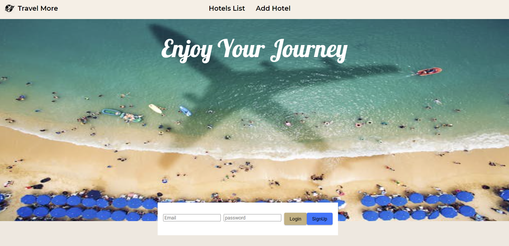
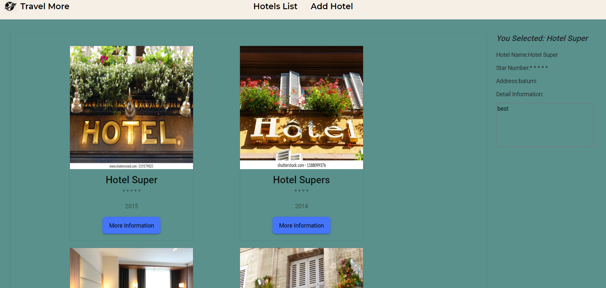
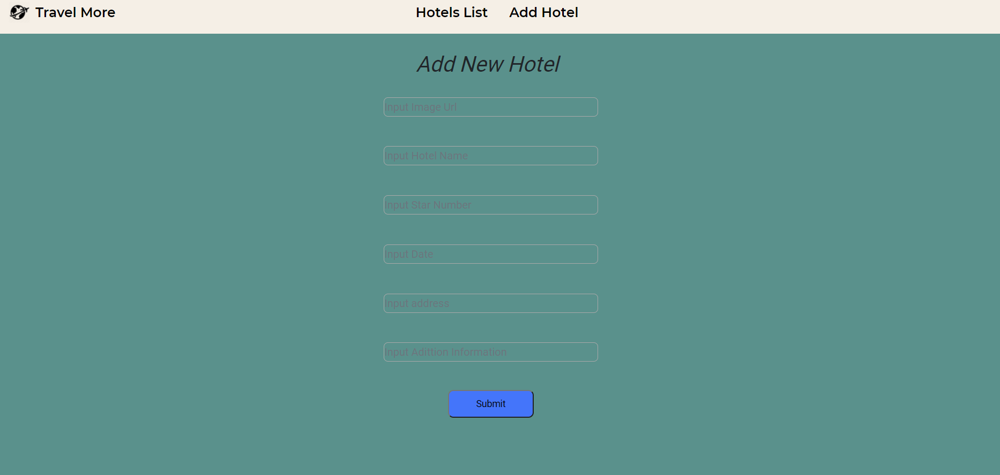
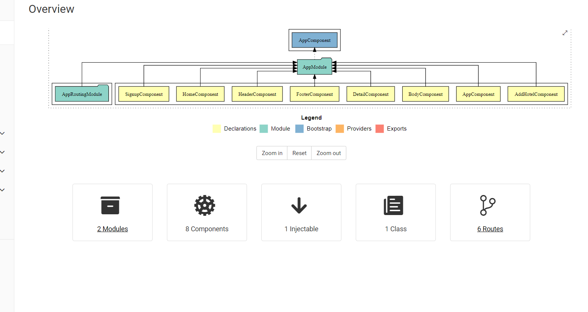

# TravellMore

კომპანიის მიზანია შიდა ტურიზმის დანერგვა და პოპულარიზაცია.

ვებ აპლიკაცია განკუთვნილია:

-ბიზნესს კლიენტებისთვის

-მომხმარებლებისთვის 

#### აპლიკაციის საწყის გვერდზე, მოცემული გვაქვს რეგისტრაცია, ავტორიზაციის პანელი.
ავტორიზაციის გავლის შემთხვევაში გადავდივართ ავტორიზაციის გასავლელ გვერდზე.

#### მეორე გვერდზე მოცემული გვაქვს სასტუმროების ჩამონათვალი და დეტალური ინფორმაცია

#### მესამე გვერდზე მოცემული გვაქვს ახალი სასტუმროების დარეგისტრირების ფორმა, რომლებიც ემატება სასტუმროების ჩამონათვალში.

#### აპლიკაციაში გამოყენებული კომპონენტები

### პროექტში გამოყენებული თულებია:

[web-fonts](https://web-fonts.ge)
[fontawesome](https://fontawesome.com)
[angular 10](https://angular.io/docs)
[angular/material @12.1.0]( https://material.angular.io/)
