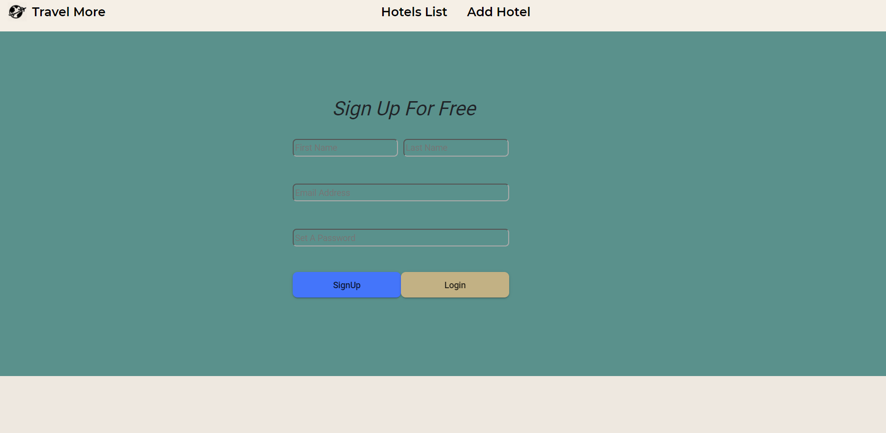

# TravellMore

კომპანიის მიზანია შიდა ტურიზმის დანერგვა და პოპულარიზაცია.

ვებ აპლიკაცია განკუთვნილია:

-ბიზნესს კლიენტებისთვის

-მომხმარებლებისთვის 

#### აპლიკაციის საწყის გვერდზე, მოცემული გვაქვს რეგისტრაცია, ავტორიზაციის პანელი.

#### მეორე გვერდზე მოცემული გვაქვს სასტუმროების ჩამონათვალი და დეტალური ინფორმაცია

#### მესამე გვერდზე მოცემული გვაქვს ახალი სასტუმროების დარეგისტრირების ფორმა, რომლებიც ემატება სასტუმროების ჩამონათვალში.

#### აპლიკაციაში გამოყენებული კომპონენტები

### პროექტში გამოყენებული თულებია:

